# 🔮Blackjack Strategy Simulator🔮

Simulate every possible blackjack scenario to discover the best move, generate custom basic strategy tables, and calculate the expected value of any strategy—all tailored to your ruleset.

[](https://github.com/AttackingOrDefending/Blackjack-Strategy-Simulator/actions/workflows/build.yml)
[](https://github.com/AttackingOrDefending/Blackjack-Strategy-Simulator/actions/workflows/test.yml)
[](https://github.com/AttackingOrDefending/Blackjack-Strategy-Simulator/actions/workflows/mypy.yml)
[](https://Blackjack-Strategy-Simulator.readthedocs.io/en/latest/)
[](https://github.com/AttackingOrDefending/Blackjack-Strategy-Simulator/blob/main/LICENSE)


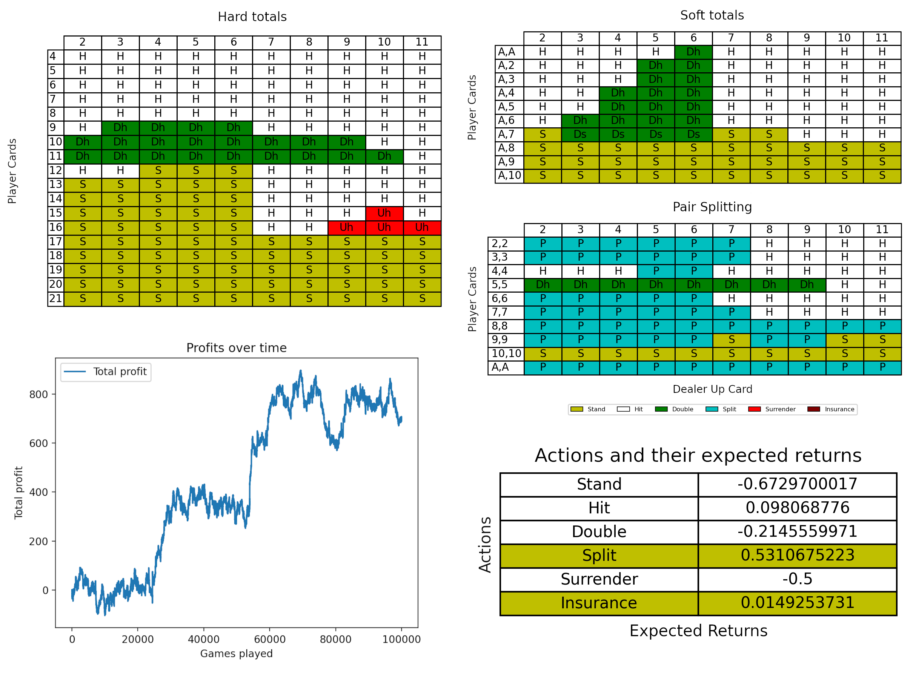

---
💡[make suggestions](https://github.com/AttackingOrDefending/Blackjack-Strategy-Simulator/issues/new?template=feature_request.md), [post bugs](https://github.com/AttackingOrDefending/Blackjack-Strategy-Simulator/issues/new?template=bug_report.md), [give feedback](https://github.com/AttackingOrDefending/Blackjack-Strategy-Simulator/issues/new).💡

<!-- TOC -->
* [✨Why?](#why)
* [🚦Usage](#usage)
  * [🔌Requirements](#requirements)
  * [🔎Basic Strategy Generation](#basic-strategy-generation)
  * [🔎Expected Value (EV) Calculation](#expected-value-ev-calculation)
  * [🔎Best Move Analysis](#best-move-analysis)
  * [🔎Play around with the included basic strategies:](#play-around-with-the-included-basic-strategies)
* [📋Supported rules](#supported-rules)
* [🍻Contributing](#contributing)
* [📖Notes](#notes)
  * [Best Move Analysis](#best-move-analysis-1)
  * [Basic Strategy Generator](#basic-strategy-generator)
  * [Expected Value Calculator](#expected-value-calculator)
* [Disclaimer](#disclaimer)
* [License](#license)
<!-- TOC -->

---

# ✨Why?

The most comprehensive open-source tool for blackjack strategy generation and evaluation.
Provides the most detailed insights available, all while being easily customizable to different rule sets.

- **Basic Strategy Generation:** Create highly customized basic strategy tables based on specific blackjack rule variations. The simulator also generates true count deviations for card counting, allowing players to adapt their strategy dynamically as the shoe evolves.
- **Best Move Analysis:** Accurately calculate the best possible action for any blackjack hand by simulating and evaluating every scenario across a variety of deck configurations and rules. Unlike other calculators, this tool takes into account complex situations such as card splits, ensuring more precise decision-making.
- **Expected Value (EV) Calculation:** Evaluate the profitability of different blackjack strategies by calculating their expected value (EV). This feature is essential for determining whether a strategy will result in long-term gains or losses, and it includes pre-built strategies such as:
  - **Card Counter:** Adapts betting and play strategy based on card counting techniques.
  - **Basic Strategy:** Follows the mathematically optimal basic moves without adjustments for card counting.
  - **Perfect Mover:** Chooses the best play in every situation by accounting for all possible outcomes.

# 🚦Usage

For a detailed explanation of what each option does see the [docs](https://Blackjack-Strategy-Simulator.readthedocs.io/en/latest/).

## 🔌Requirements

Install the requirements using `pip install -r requirements.txt`.

## 🔎Basic Strategy Generation

* Generate basic strategy:
```commandline
python basic_strategy_generator.py
```

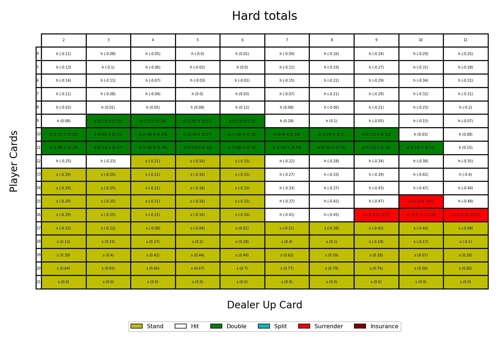
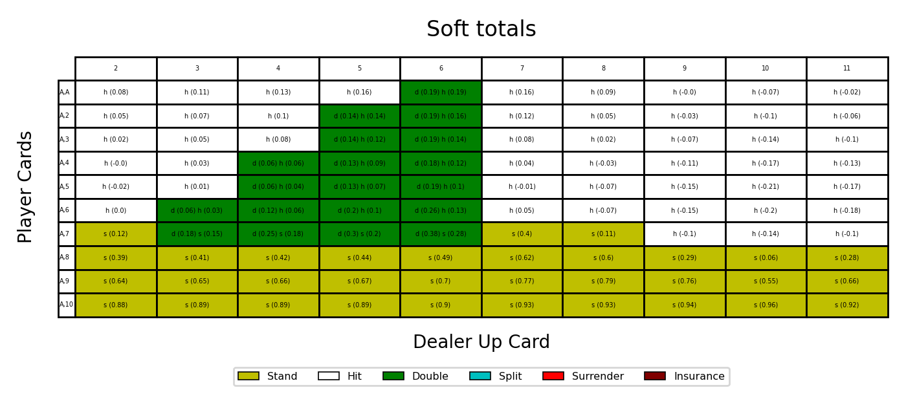
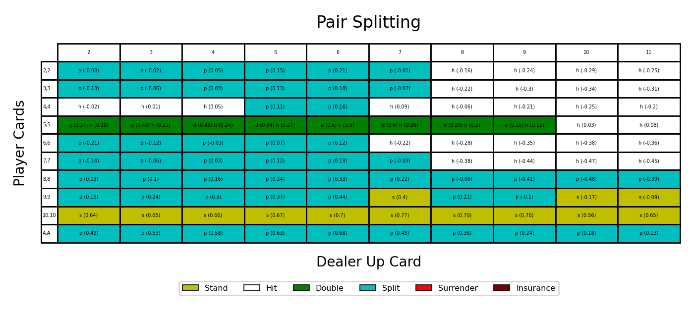

* Save the results to a file:
```commandline
python basic_strategy_generator.py --filename=basic_strategy.csv
```
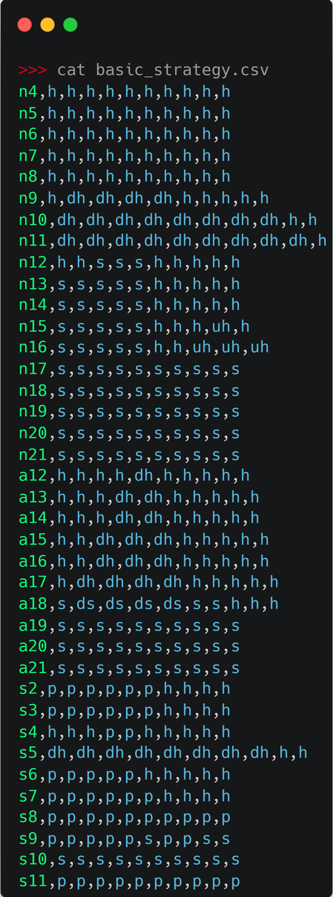

* Run more hand combinations:

_From 0 (fastest, very accurate) to 5 (very slow, super accurate). Default is 0._
```commandline
python basic_strategy_generator.py --effort=2
```

* Generate deviations from basic strategy:
```commandline
python basic_strategy_generator.py --true-count=-5
```

* Run with different rules:
```commandline
python basic_strategy_generator.py --decks=4 --stand17 --das --no-peek --surrender
python basic_strategy_generator.py --decks=8 --deck-penetration=0.2 --hit17 --no-das --peek --no-surrender
python basic_strategy_generator.py --hit17 --no-surrender  # Uses default values for `decks`, `das`, etc.
```

* Plot a basic strategy from a file.
```commandline
python plot_basic_strategy.py --filename=data/6deck_s17_das_peek_tc_plus_5.csv
```

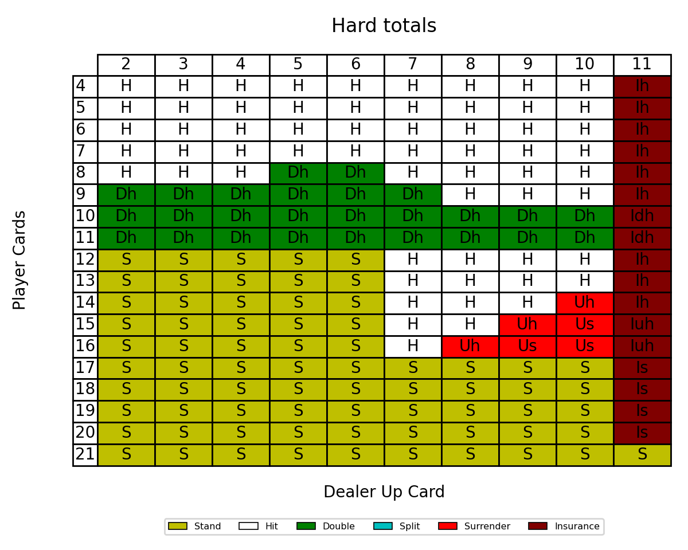
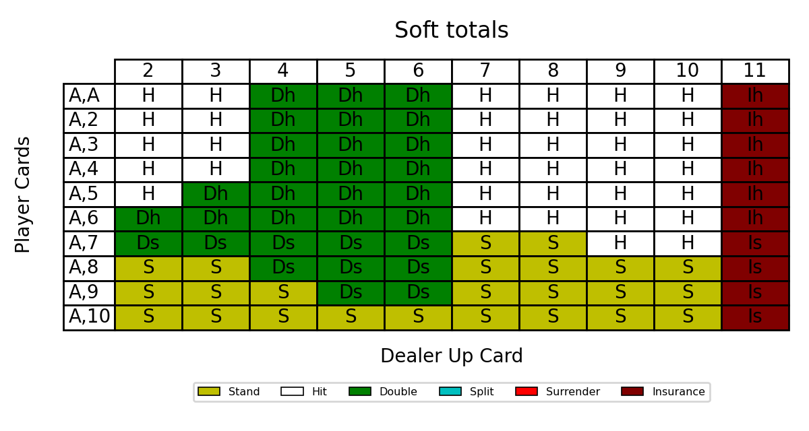
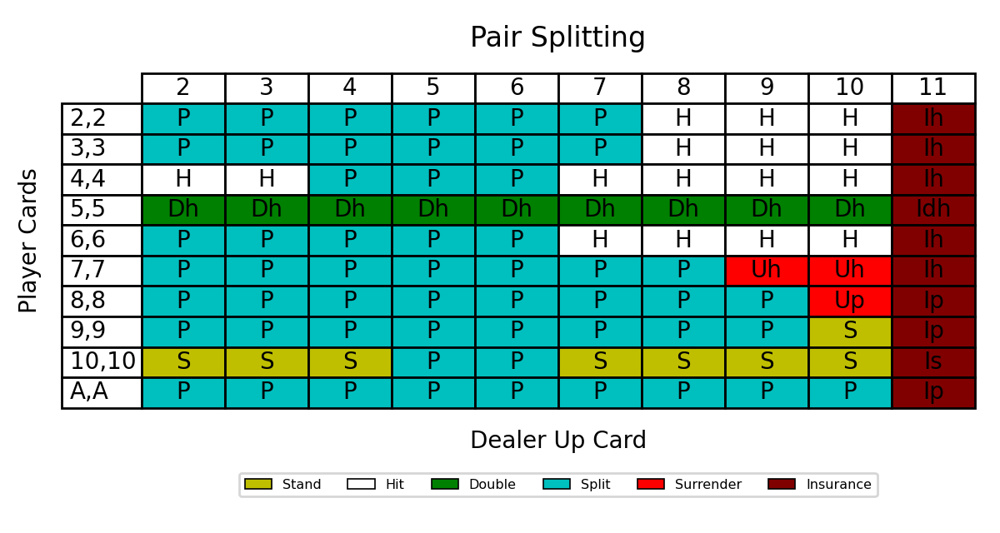
_This example uses a basic strategy generated for a true count of +5._

* Combine these options together!
```commandline
python basic_strategy_generator.py --effort=1 --filename=true_count_plus_3.csv --true-count=3 --decks=4 --stand17
```

## 🔎Expected Value (EV) Calculation

* Calculate EV:
```commandline
python expected_value.py
```

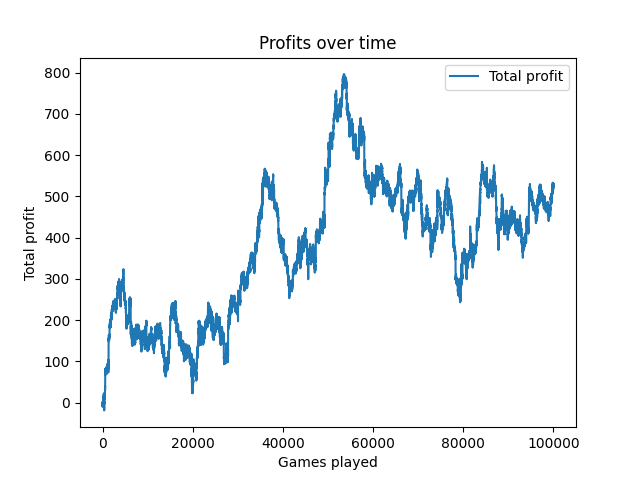

`Total profit: 522.5, Average profit: 0.005225`

* Test different playing strategies:
```commandline
python expected_value.py --mover=card-count --better=card-count
python expected_value.py --mover=basic-strategy --better=simple
```

* Run more simulations:
```commandline
python expected_value.py --simulations=1_000_000
```

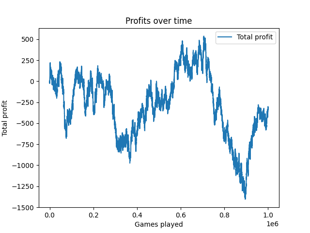

`Total profit: -332.0, Average profit: -0.000332`

* Test your custom strategy:

_Put your custom movers and betters in `action_strategies.py` and `betting_strategies.py` respectively._
```commandline
python expected_value.py --mover=CustomStrategy
python expected_value.py --better=CustomBetter
```

* Test your advanced custom strategy:

_Requires changing `expected_value.py` to initialize your custom strategies._
```commandline
python expected_value.py --custom
```

* Run with different rules:
```commandline
python expected_value.py --decks=4 --no-peek --surrender
python expected_value.py --hit17 --das
```

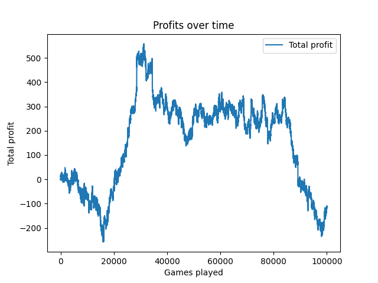

* Combine these options together!
```commandline
python expected_value.py --mover=card-count --better=simple --simulations=500_000 --hit17 --das
```

## 🔎Best Move Analysis

* Calculate the best possible action:
```commandline
python best_move.py --cards=9,4 --dealer-card=10
```

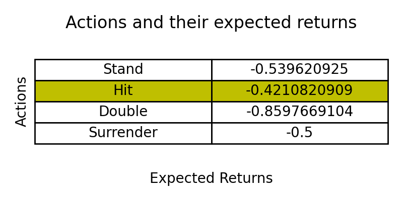

* Change the number of decks:
```commandline
python best_move.py --cards=A,3,2 --dealer-card=5 --decks=4
```

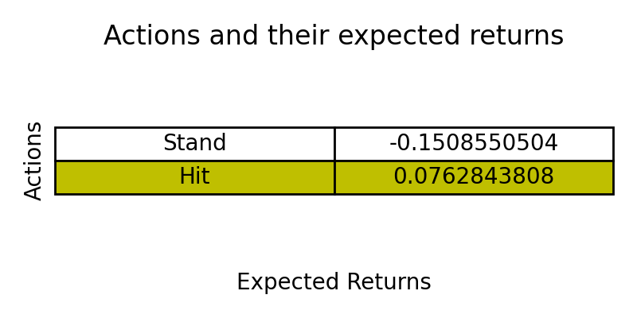

* Change the number of times the player can split:

_From 1 (fastest, fairly accurate) to 3 (slowest, super accurate). Default is 1._
```commandline
python best_move.py --cards=8,8 --dealer-card=5 --split=2
```

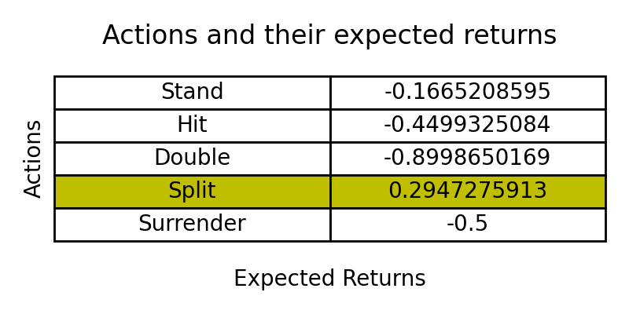

* Run with different rules:
```commandline
python best_move.py --cards=7,3,5 --dealer-card=8 --decks=2 --peek --surrender
python best_move.py --cards=8,8 --dealer-card=2 --decks=10 --hit17 --das --no-peek
```

* Change the composition of the deck:
```commandline
python best_move.py --cards=A,A --dealer-card=A --shoe=2,2,2,2,3,3,3,4,4,5,5,5,6,6,6,6,7,7,7,8,8,8,9,9,9,10,10,10,10,10,10,10,10,10,10,10,10,10,10,10,10,11,11,11,11
python best_move.py --cards=4,6,4,2 --dealer-card=6 --shoe=10,8,2,9,9,6,5,2,6,2,6,3,10,8,10,10,10,9,7,8,6,10,7,10
```

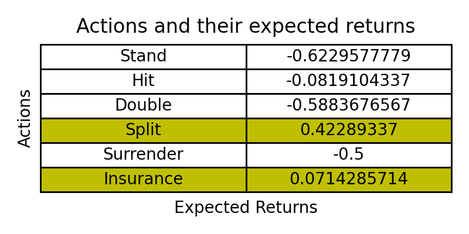

* Combine these options together!
```commandline
python best_move.py --cards=3,9,7 --dealer-card=6 --decks=1 --peek --split=3
```

## 🔎Play around with the included basic strategies:

They are stored in [`data/`](data) and include a basic strategy (`RULES_basic_strategy.csv`) and deviations for each true count from -10 to +10 (`RULES_tc_plus/minus_X.csv`).

* Plot them:
```commandline
python plot_basic_strategy.py --filename=data/6deck_s17_das_peek_tc_minus_2.csv
```
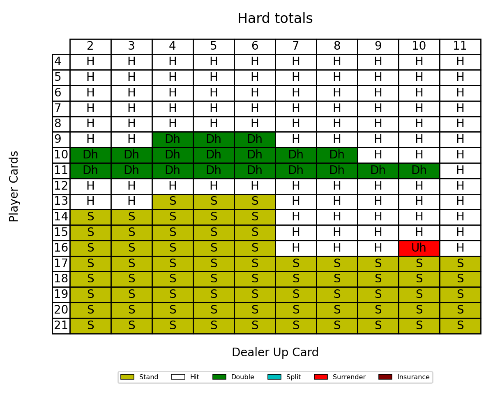
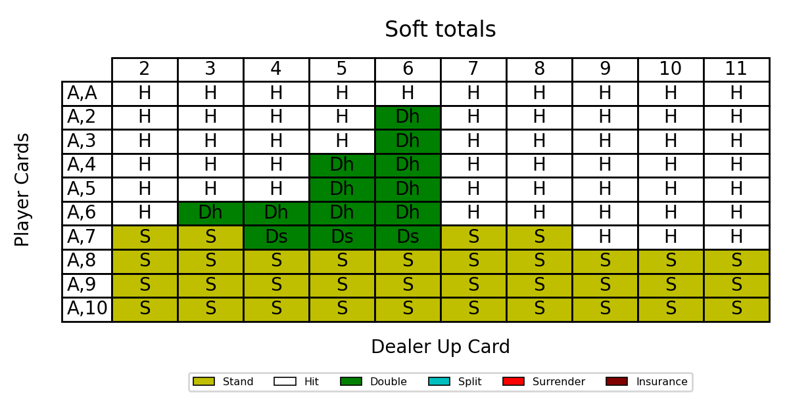
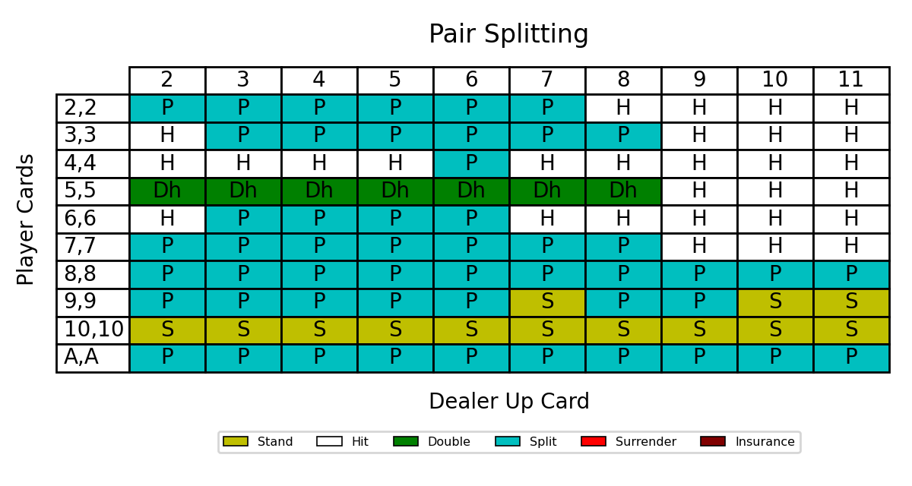
_This example uses a basic strategy generated for a true count of -2._

* Use them in the Expected Value (EV) Calculation:

`expected_value.py`:
```python
if args.custom:
    # ADD CUSTOM CODE HERE IF YOU HAVE BUILT YOUR OWN MOVER OR BETTER.
    mover = action_strategies.CardCountMover({(-1000, 1): "data/6deck_s17_das_peek_basic_strategy.csv", (1, 2): "data/6deck_s17_das_peek_tc_plus_1.csv", (2, 1000): "data/6deck_s17_das_peek_tc_plus_2.csv"})
    better = betting_strategies.CardCountBetter()
```
```commandline
python expected_value.py --custom
```

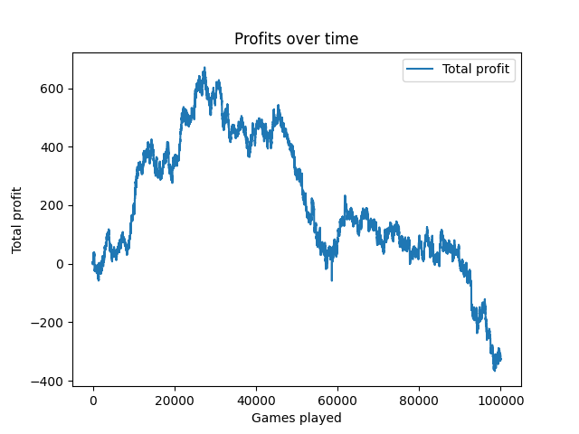

`Total profit: -327.5, Average profit: -0.003275`

The included basic strategies were generated with the following rules:
- 6 decks
- Dealer Stands on Soft 17
- Double After Split Allowed
- Dealer Peeks For Blackjack
- Surrender Allowed

# 📋Supported rules

- Variable amount of decks
- Dealer stands/hits on soft 17
- Double after split allowed/not allowed
- Dealer peeks for BJ/doesn't peek
- Surrendering allowed/not allowed

# 🍻Contributing

All contributions are welcome. See [CONTRIBUTING](CONTRIBUTING.md) for more information.

[](https://github.com/AttackingOrDefending/Blackjack-Strategy-Simulator/graphs/contributors)

🌟 As an open-source tool, it would mean the world to me if you starred the Blackjack Strategy Simulator repo 🌟

# 📖Notes

While this program tries to be as accurate as possible, there may be some problems, 
so one should not base their blackjack strategy on this program.
This program was written to investigate blackjack theoretically, using combinatorial/probabilistic simulators and monte carlo simulations.

## Best Move Analysis

The Best Move Analysis doesn't take into account the cards the other hand gets when hitting after a split 
(which is better than most calculators, as most don't even take the first card the other hand gets after a split into account while this calculator does).
It can also waste a few splits since it either gives all of the remaining splits to the first hand or the second one, and cannot give some to the first and some to the second.
These minor problems are very unlikely to cause the engine to make a wrong move.

## Basic Strategy Generator

To take into account all possible hands the generator would have to be run with `effort=5`.
This will take a very long time and it is highly unlikely that it will change the best action for a given hand value and dealer up card.
Also, the generator doesn't take into account the likelihood of a hand occurring during play, as this depends on the strategy played.

## Expected Value Calculator

For the most accurate result the calculator has to run millions of simulations.

# Disclaimer

**This program is intended for educational purposes only. It does not guarantee or promote gambling success in any casino or gaming environment.**

# License
This program is licensed under the AGPLv3 (or any later version at your option). Check out the [LICENSE file](LICENSE) for the full text.
